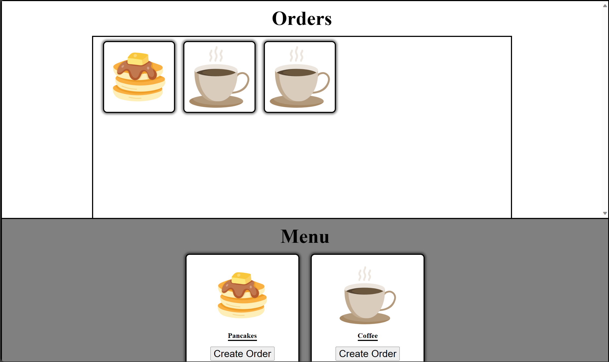

# State variables in React

## Assignment: Sally's Pancake shop (React version)
In this assignment, you will recreate a Point-Of-Sale interface for the pancake shop owner Sally in React. You will use a [React state variable](https://react.dev/learn/state-a-components-memory) to automatically update the page when new orders are created or removed.


### Instructions
DO NOT MODIFY [THE CSS file](sallys-pancakes\src\App.css) at all for this assignment

### **Part 1: Display Orders**
<details>
    <summary>Preview</summary>
  
</details>
<br/>

Configure [the App component](sallys-pancakes\src\App.js) to render the order html elements in the array declared on line 9

 - Embed the array of order html elements inside the HTML for the whole component. The HTML for the whole component is inside the return statement at the bottom (starts on line 32)
     <details>
    <summary>You can embed and array of HTML elements using curly braces {}</summary>

    ```javascript
    //Figure out where to put this
    {ordersHTMLArray}
    ```
    </details>

<br/>

### **Part 2: Extra default order**
<details>
    <summary>Preview</summary>
  
</details>
<br/>

Configure [the App component](sallys-pancakes\src\App.js) to render an extra default order element so that 4 orders are displayed instead of 3

<br/>


### **Part 3: Create Order button**
Configure the buttons for the menu options at the bottom to create new orders when clicked


  1.  When user clicks "Create Order", add a new order string to the array of orders

      <details>
          <summary>Preview</summary>
          
      </details>
      <br/>
      
      - When user clicks "Create Order, console log the array of order strings

      - When user clicks "Create Order, add a new order to array of order strings
  
  <br/>
  
  2.  When user clicks "Create Order", the new order should appear on the page

      <details>
          <summary>Preview</summary>
          
      </details>
      <br/>
      
      - Change the variable holding the array of order strings to a [React state variable](https://react.dev/learn/state-a-components-memory)

      - Add a new order to the array of order strings by [updating the state variable with its setter function](https://react.dev/learn/updating-arrays-in-state)

<br/>

### **Part 4: Remove Orders**
Add a button to each order element that removes it 
<details>
    <summary>Preview</summary>
  
</details>
<br/>

 - Add a button that says "Ready" to the order elements
 - Configure the Ready button on each order to remove the corresponding order string from the array of orders
    - Youll need to use [the setter function again](https://react.dev/learn/updating-arrays-in-state)


<br>


Take a look at the Example folder to see what the end result should look like.
